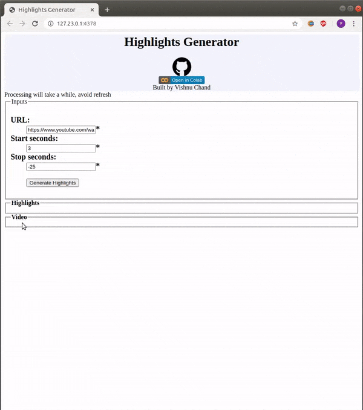

# Highlights Generator

### Analyse and generate highlights of the game (like football, cricket, etc.) from youtube video
* Using audio processing algorithm looks for the moments where the crowd cheers.
* When crowd/commerty shouts, there will be a spike in volume, and algorthim detects such moments and compile highlights list

### Click gif to use the web app 

                
